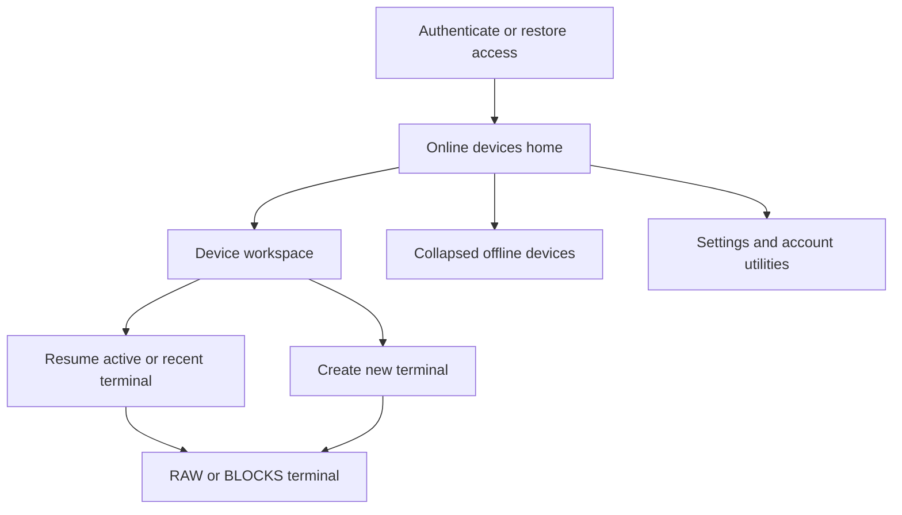
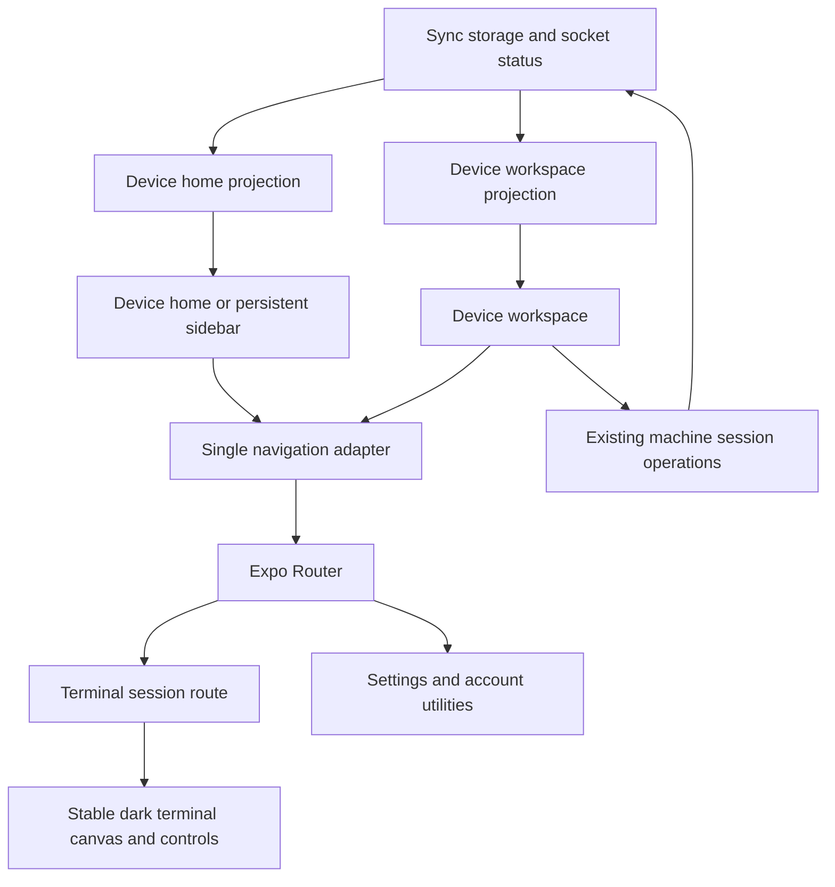
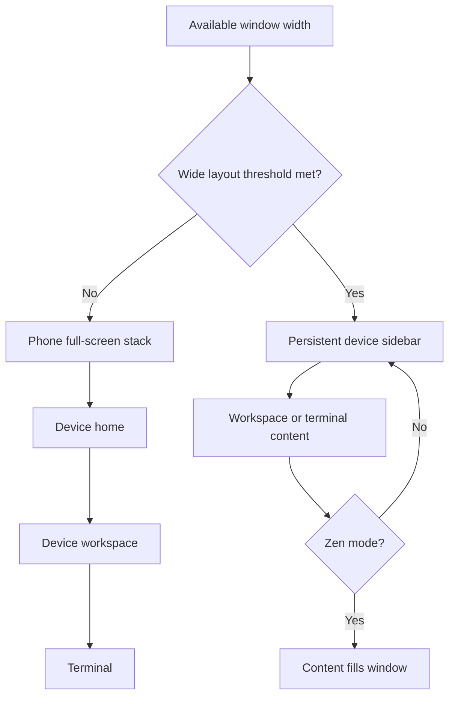
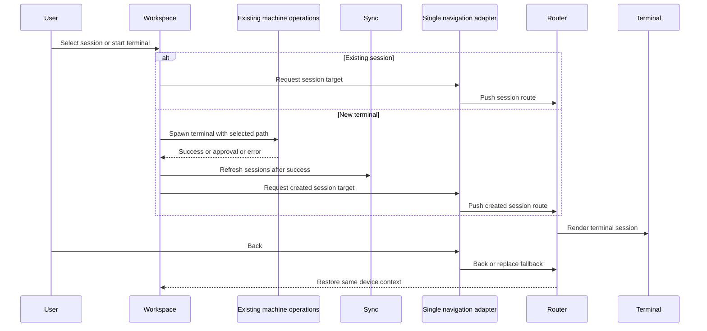
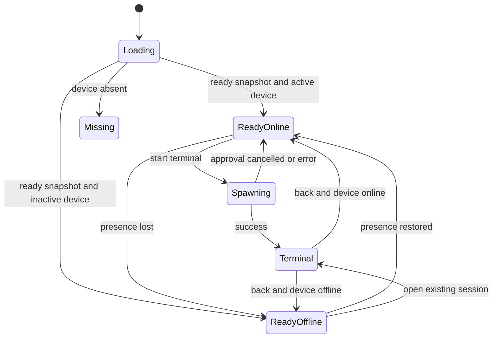

# Device-First OpenCode-Inspired UI - Plan

## Goal Capsule

- **Objective:** Reframe the entire Happy app as a device-first terminal workspace with one OpenCode-inspired visual language across mobile, tablet, desktop, light theme, and dark theme.
- **Product authority:** The Product Contract owns user-visible scope and behavior. The OpenCode analysis is a visual reference, not authority for Happy's navigation, branding, or feature set.
- **Implementation authority:** Key Technical Decisions and Implementation Units own code structure, sequencing, and verification without weakening the Product Contract.
- **Execution profile:** Complete the dependency-ordered units as one whole-app refactor. Do not ship a separately scoped MVP or add business capabilities.
- **Stop conditions:** Stop if implementation requires a server, CLI, authentication-protocol, session-protocol, or terminal-runtime change that is not needed for UI compatibility, or if a settled product decision becomes infeasible.
- **Tail ownership:** The final implementation pass owns cross-platform runtime QA, accessibility checks, documentation evidence, cleanup of abandoned approaches, and the complete verification matrix.

---

## Product Contract

### Summary

This plan extends Happy's existing theme runtime, responsive shell, and machine route to deliver the confirmed device-first experience without adding a second navigation or styling system.
The whole app adopts an adapted OpenCode visual grammar while the terminal remains a stable dark working surface and all current terminal-only capabilities remain reachable.

### Problem Frame

Happy's current screens use multiple visual conventions: rounded and elevated native-style cards, a separate Warp-inspired terminal surface, and distinct mobile and desktop navigation treatments.
The desired improvement is a coherent developer-tool aesthetic based on OpenCode's typography, warm neutral palette, hairline borders, flat surfaces, and terminal character.
The reference does not document OpenCode's real mobile product interface, so Happy needs its own device-first product structure rather than a copied screen layout.

### Key Decisions

- **Whole-app redesign** (session-settled: user-directed - chosen over core-flow or terminal-only scope: the app should feel like one complete product). Governs R1, R10, R11, R14.
- **Adapt the reference instead of reproducing it** (session-settled: user-directed - chosen over a highly faithful or optional-theme treatment: mobile and Chinese text must remain readable). Governs R2, R3, R4, R5.
- **Design light and dark themes together** (session-settled: user-directed - chosen over dark-first or dark-only delivery: both existing appearance choices remain first-class). Governs R2, R5, R13.
- **Use a device-first workspace model** (session-settled: user-directed - chosen over session-first or terminal-first navigation: opening the app should reveal online devices). Governs R6, R7, R8, R9, R11.
- **Reorganize current capabilities without expanding them** (session-settled: user-directed - chosen over adding new product capabilities during the redesign: visual and structural coherence are the active outcome). Governs R8, R9, R10, R12, R15, R16.

### Actors

- A1. The Happy user is a developer remotely locating a device, resuming or creating a terminal session, and controlling that terminal.
- A2. A connected device supplies presence, identity, and the terminal sessions available to A1.

### Requirements

**Visual language**

- R1. Every user-facing screen and state must use one shared hierarchy of canvas, surface, border, text, control, and semantic-status roles.
- R2. Light mode must use a warm light canvas with near-black text, while dark mode must use a near-black canvas with warm neutral text and surfaces.
- R3. Monospaced typography must identify code, commands, paths, numbers, statuses, and short developer-facing labels; Chinese and long-form body text must use a readable proportional face.
- R4. The default presentation must be flat and restrained: hairline separation, sharp structural regions, low-radius interactive controls, no gradients, no glass effects, and no decorative elevation.
- R5. Both themes must preserve readable contrast, text scaling, touch usability, safe areas, keyboard behavior, and accessibility labels.

**Product structure**

- R6. The authenticated home must show online devices first and place offline devices in a collapsed section below them.
- R7. Selecting an online device must open a device workspace containing device identity and status, active and recent terminal sessions, and a clear new-terminal action.
- R8. Selecting a terminal session must open it, while the new-terminal action must create a session through Happy's existing terminal behavior.
- R9. The device workspace must remain the parent context when the user reviews sessions or returns from a terminal.
- R10. Authentication, credential recovery, custom-server selection, account settings, appearance settings, feature settings, and device management must remain reachable in the reorganized app.
- R11. Phone layouts must use progressive full-screen navigation, while tablet and desktop layouts must keep device context visible alongside the active workspace or terminal when space allows.

**Terminal experience and compatibility**

- R12. RAW and BLOCKS modes, terminal shortcuts, modifiers, history, reconnect behavior, copy actions, and current session controls must retain their existing product behavior.
- R13. The terminal canvas must remain a stable high-contrast dark working surface in both app themes; surrounding chrome must integrate it with the selected app theme.
- R14. Loading, empty, spawning, online, offline, disconnected, permission, error, deleted-session, and unsupported-session states must receive the same visual-system treatment as primary screens.
- R15. The redesign must not add project management, file browsing, global search, agent chat, or other new business capabilities.
- R16. Legacy non-terminal sessions must continue to show a clear unsupported-state explanation rather than restoring the removed agent UI.

### Key Flows



- F1. Device discovery
  - **Trigger:** A1 opens an authenticated Happy app.
  - **Actors:** A1, A2
  - **Steps:** Happy presents online devices first and keeps offline devices collapsed below.
  - **Outcome:** A1 can identify an available device without first navigating through sessions.
  - **Covered by:** R6, R14.
- F2. Resume a terminal
  - **Trigger:** A1 selects an online device.
  - **Actors:** A1, A2
  - **Steps:** Happy opens the device workspace; A1 selects an active or recent terminal session; Happy opens the terminal with the device context preserved for return navigation.
  - **Outcome:** A1 resumes work through the existing terminal experience.
  - **Covered by:** R7, R8, R9, R12.
- F3. Start a terminal
  - **Trigger:** A1 chooses the new-terminal action in a device workspace.
  - **Actors:** A1, A2
  - **Steps:** Happy uses its existing terminal-spawn behavior and opens the resulting terminal session.
  - **Outcome:** A1 reaches a usable terminal without leaving the selected device context.
  - **Covered by:** R7, R8, R9, R12.
- F4. Change appearance
  - **Trigger:** A1 selects adaptive, light, or dark appearance in settings.
  - **Actors:** A1
  - **Steps:** Happy applies the corresponding visual tokens across navigation, device workspace, settings, states, and terminal chrome.
  - **Outcome:** The interface remains coherent and readable while the terminal canvas stays stable.
  - **Covered by:** R2, R3, R5, R10, R13.

### Acceptance Examples

- AE1. Online and offline device grouping
  - **Covers R6, R14.**
  - **Given:** At least one device is online and at least one is offline.
  - **When:** A1 opens the authenticated app.
  - **Then:** Online devices are immediately visible and offline devices are available from a collapsed section below.
- AE2. Device with no terminal history
  - **Covers R7, R14.**
  - **Given:** An online device has no active or recent terminal sessions.
  - **When:** A1 opens its device workspace.
  - **Then:** The workspace shows a visually integrated empty state and a prominent new-terminal action.
- AE3. Resume or create terminal
  - **Covers R8, R9, R12.**
  - **Given:** A1 is in an online device workspace.
  - **When:** A1 selects a listed session or chooses new terminal.
  - **Then:** Happy opens the corresponding terminal and returns to the same device workspace when A1 navigates back.
- AE4. Dual-theme readability
  - **Covers R2, R3, R5, R13.**
  - **Given:** A screen contains Chinese body text, English status labels, paths, numbers, and terminal output.
  - **When:** A1 switches between light, dark, and adaptive appearance, including a system-theme change while adaptive mode is active.
  - **Then:** Body text and platform chrome remain readable, developer data remains monospaced, semantic meaning remains clear, and the terminal canvas remains stable.
- AE5. Offline device interaction
  - **Covers R6, R7, R14.**
  - **Given:** A2 is offline.
  - **When:** A1 expands offline devices and selects A2.
  - **Then:** Happy communicates the offline state and does not present an action that implies a terminal can be started immediately.
- AE6. Unsupported historical session
  - **Covers R14, R16.**
  - **Given:** A1 opens a legacy non-terminal session record.
  - **When:** Happy evaluates the session type.
  - **Then:** Happy shows the unsupported-session explanation in the new visual system and does not render the removed agent chat UI.

### Success Criteria

- The first authenticated screen identifies online devices without an intermediate session view.
- One selection opens a device workspace, and one additional action resumes or starts a terminal.
- All reachable screens and conditional states use the shared visual language in light, dark, and adaptive appearance.
- Existing terminal and settings capabilities remain reachable and behaviorally intact after navigation is reorganized.
- Chinese body text and developer-oriented monospace content retain distinct, readable roles on supported phone, tablet, and desktop layouts.

### Scope Boundaries

- The work covers the complete current Happy app experience rather than a separately shipped minimum slice; implementation may still be sequenced safely.
- It does not restore legacy agent chat or introduce project browsing, file management, search, automation, or new remote-device operations.
- It does not copy OpenCode branding, ASCII wordmarks, marketing page composition, or proprietary Berkeley Mono assets.
- It does not redesign server, CLI, authentication protocol, session protocol, or terminal runtime behavior except where UI compatibility is required.

#### Deferred to Follow-Up Work

- Automated screenshot baselines and a new React Native component-test harness remain follow-up infrastructure; this refactor uses the existing Vitest contract plus recorded runtime QA.
- The stale three-column agent/context-panel proposal in `docs/layout-core.md` remains outside this terminal-only redesign.

### Dependencies / Assumptions

- Happy remains a terminal-only product for this work.
- Existing adaptive, light, and dark appearance preferences remain available.
- Existing machine presence, terminal spawn, session listing, and terminal controls supply the behaviors reorganized by this contract.
- The OpenCode reference is visual grammar because its captured material is a marketing design system and does not specify the real mobile product interface.

### Sources / Research

- [OpenCode design-system analysis](https://getdesign.md/opencode.ai/design-md)
- `packages/happy-app/sources/theme.ts`
- `packages/happy-app/sources/constants/Typography.ts`
- `packages/happy-app/sources/components/TerminalsHomeView.tsx`
- `packages/happy-app/sources/components/MainView.tsx`
- `packages/happy-app/sources/components/SidebarNavigator.tsx`
- `packages/happy-app/sources/app/(app)/machine/[id].tsx`
- `packages/happy-app/sources/-session/SessionView.tsx`
- `packages/happy-app/sources/-session/terminal/terminalVisualTheme.ts`
- `packages/happy-app/design-qa.md`

---

## Planning Contract

Product Contract preservation: restructured, no scope change - the Summary now carries the implementation posture and AE4 clarifies existing adaptive-theme behavior; all R, F, and AE IDs remain stable.

### Key Technical Decisions

- KTD1. **Keep React Native Unistyles as the single app-theme runtime.** Extend `packages/happy-app/sources/theme.ts` with semantic canvas, surface, border, text, control, focus, and status roles for both themes. Preserve widely consumed aliases such as `colors.groupped.background` during migration so root/system background synchronization and untouched consumers do not break.
- KTD2. **Use IBM Plex Mono for developer data and IBM Plex Sans for readable body copy.** (session-settled: user-directed - chosen over copying OpenCode's all-monospace treatment: Chinese and long-form text must remain readable). Extend semantic typography roles in `packages/happy-app/sources/constants/Typography.ts`; do not add Berkeley Mono or another font dependency. Implements R3 and the adapted-reference decision governing R2-R5.
- KTD3. **Migrate foundations before screens.** Normalize buttons, cards, badges, grouped items, headers, modals, and overlays to sharp structural regions, 4px interactive radii, hairline borders, and no decorative shadow or elevation. Preserve control behavior such as `RoundButton` asynchronous loading while changing presentation.
- KTD4. **Extend the existing shell and machine route instead of adding parallel navigation.** `MainView`, `SidebarNavigator`, and `SidebarView` remain shell owners; `/machine/[id]` becomes the device workspace. The old home spawn-on-tap path is removed, and advanced device management remains a secondary workspace region.
- KTD5. **Choose shell composition and navigation affordances by available width, not hardware identity.** Adopt the existing Unistyles `lg` value of 800px as the shell breakpoint; it is a token reuse, not an existing shell rule. The width-derived shell mode owns sidebar presence, page composition, and Back visibility. Physical device type remains authoritative only for platform header height and terminal ergonomics. Preserve the non-animated web drawer-width transition to avoid repeated list reflow.
- KTD6. **Make the device workspace the canonical session parent through one navigation adapter.** A pure device-navigation resolver determines workspace, session, and fallback targets but never calls Expo Router. The existing session-navigation adapter owns push, Back, replace, and coordination with browser-history state. Workspace resume and spawn preserve the real parent stack; direct, notification, refresh, and deep-link entry use session metadata only when no usable parent exists. Wide layouts derive selected-device context from either the machine route or the active session's machine ID.
- KTD7. **Use pure projection models for device and session states.** Device grouping uses `machine.active` through `isMachineOnline`, sorts each group by recent activity, and keeps offline devices collapsed by default. Workspace sessions include only terminal flavor for the selected machine; active and inactive recent sessions are disjoint and sorted by `updatedAt`, with the current five-item recent limit retained.
- KTD8. **Use the existing path launcher as the authoritative new-terminal behavior.** Preserve custom and recent paths, directory-resolution and creation approval, loading/disabled states, and errors. Always request terminal flavor and remove the obsolete double-back behavior.
- KTD9. **Keep the terminal as a stable dark island.** App-shell boundaries adopt the active theme, while terminal canvas, ANSI/syntax colors, RAW/BLOCKS state, persisted preferences, attach ordering, native/web render paths, and local TUI scroll semantics remain owned by the terminal modules.
- KTD10. **Use a unified cutover after all units pass.** (session-settled: user-directed - chosen over a separately shipped MVP slice: the user asked for the complete existing product to feel coherent). Units may land in dependency order, but the refactor is not complete until every reachable surface passes the Verification Contract.
- KTD11. **Do not introduce a UI-test framework during the refactor.** Vitest currently runs Node `.ts` tests, so device grouping, workspace projection, responsive mode, route fallbacks, and injectable workspace actions become pure tested modules. Cross-platform TSX presentation is proven through recorded Expo and web runtime QA, with deterministic dev-only projections for states that a live backend cannot reproduce reliably.

### High-Level Technical Design

The existing storage and operation layers remain authoritative. New pure models translate their state into device-first view data, the responsive shell chooses how the same routes compose, and one navigation adapter remains the only layer that mutates route and browser-history state.



The responsive shell has two compositions but one route model.



Resume and spawn use the same parent-context invariant.



The device workspace stays useful when presence changes.



### Output Structure

The refactor introduces a device-owned component boundary while keeping route wrappers thin.

```text
packages/happy-app/sources/components/device/
|-- DevicesHomeView.tsx
|-- DeviceList.tsx
|-- DeviceWorkspace.tsx
|-- DeviceManagementSections.tsx
|-- deviceFirstQaFixtures.ts
|-- deviceFirstQaFixtures.test.ts
|-- deviceWorkspaceActions.ts
|-- deviceWorkspaceActions.test.ts
|-- deviceWorkspaceModel.ts
`-- deviceWorkspaceModel.test.ts
```

Machine grouping remains in `packages/happy-app/sources/utils/machineUtils.ts` because settings and the device home share it. Navigation fallback logic remains under `packages/happy-app/sources/navigation/` because direct session entry and the responsive shell share it.

### Sequencing

1. Establish semantic theme, typography, and shared component foundations.
2. Add pure machine/session/navigation projections with characterization tests.
3. Replace the terminal-first home with device discovery and reshape the machine route into a workspace.
4. Recompose phone and wide navigation around the new device context.
5. Apply the visual system to account utilities, secondary routes, overlays, and terminal chrome.
6. Complete the full automated and runtime QA matrix before treating any partial surface as deliverable.

### System-Wide Impact

- **End users:** The first authenticated screen and navigation hierarchy change on every platform, but terminal operations and settings capabilities remain intact.
- **App developers:** Semantic theme and typography roles replace page-local visual choices; pure view models become the test seam for UI state rules.
- **Server and CLI:** No API, schema, daemon protocol, or terminal runtime changes are planned.
- **Localization:** New device-workspace labels must preserve the exact typed translation structure across every supported locale.
- **Performance:** Wide web drawer width must continue to snap rather than animate, and long session/device lists must retain bounded or virtualized rendering.
- **Navigation:** The width-derived shell mode must control both composition and Back visibility; device classification must not hide Back inside a narrow full-screen stack.
- **Accessibility:** Focus, roles, labels, touch targets, safe areas, keyboard behavior, contrast, and text scaling become release gates across both shell compositions.

### Risks and Mitigations

- **Hard-coded color overreach:** The app has many literal colors, including intentional terminal and syntax palettes. Restrict global replacement to application chrome; keep terminal colors under terminal ownership.
- **Route-context regression:** The current machine launcher pops two routes before session navigation. Add pure fallback tests and runtime checks for workspace, direct link, notification, browser refresh, and Back.
- **Dual navigation authority:** A target resolver, Expo Router calls, and browser-history marks can diverge if they mutate state independently. Keep target selection pure and route every mutation through the existing session-navigation adapter and browser-history authority.
- **Stale-presence ambiguity:** Initial readiness and socket state are separate. Model loading, empty, disconnected, and cached-device states explicitly instead of treating an empty array as one state.
- **Terminal behavior regression:** UI edits touch sensitive RAW/BLOCKS surfaces. Keep terminal changes presentation-only and run the entire terminal test directory, including the local TUI scroll regression.
- **Cross-locale drift:** Translation objects have exact structural typing. Add keys to every supported locale in one unit and let typecheck block partial updates.
- **Uncovered TSX visuals:** The current Vitest include excludes `.tsx`. Record real phone and web evidence for all conditional states rather than claiming unit coverage for rendering.
- **Scope drift from historical docs:** `docs/layout-core.md` proposes removed agent/context features. Treat it as historical evidence only and follow R15-R16.

### Deferred Implementation Notes

- Exact neutral and semantic color values may be adjusted during contrast and device QA, but the role hierarchy and OpenCode-derived warm cream/near-black direction are fixed.
- The 800px wide-layout threshold may be tuned only if runtime evidence shows an unusable workspace width; any change must keep the width-driven rule and responsive tests.
- Internal component boundaries may be combined when extraction adds no reuse, but the route, pure model, and management-region ownership must remain separated.
- U4 owns `SessionView` navigation and Back behavior; U6 may restyle that file but must not introduce a second navigation policy.
- U4 owns authenticated index composition; U5 owns unauthenticated index presentation and authentication actions.

---

## Implementation Units

### U1. Establish the semantic visual foundation

- **Goal:** Replace the mixed visual vocabulary with one tested theme, typography, and primitive contract that every later screen can consume.
- **Requirements:** R1-R5, R13-R14; supports F4 and AE4 through KTD1-KTD3.
- **Dependencies:** None.
- **Files:**
  - Create `packages/happy-app/sources/themeSemantics.ts`
  - Create `packages/happy-app/sources/themeSemantics.test.ts`
  - Modify `packages/happy-app/sources/theme.ts`
  - Modify `packages/happy-app/sources/unistyles.ts`
  - Modify `packages/happy-app/sources/constants/Typography.ts`
  - Modify `packages/happy-app/sources/components/ui/text.tsx`
  - Modify `packages/happy-app/sources/components/ui/button.tsx`
  - Modify `packages/happy-app/sources/components/ui/card.tsx`
  - Modify `packages/happy-app/sources/components/ui/badge.tsx`
  - Modify `packages/happy-app/sources/components/Item.tsx`
  - Modify `packages/happy-app/sources/components/ItemGroup.tsx`
  - Modify `packages/happy-app/sources/components/ItemList.tsx`
  - Modify `packages/happy-app/sources/components/RoundButton.tsx`
  - Modify `packages/happy-app/sources/components/navigation/Header.tsx`
  - Modify `packages/happy-app/sources/modal/components/BaseModal.tsx`
  - Modify `packages/happy-app/sources/modal/components/CustomModal.tsx`
  - Modify `packages/happy-app/sources/modal/components/WebAlertModal.tsx`
  - Modify `packages/happy-app/sources/modal/components/WebPromptModal.tsx`
- **Approach:**
  1. Define platform-independent semantic seeds for light and dark roles, spacing, structural and interactive radii, focus, and status.
  2. Compose the existing Unistyles theme shape from those roles while retaining compatibility aliases used by root/system backgrounds and legacy consumers.
  3. Add explicit proportional-body and mono-developer typography roles using the fonts already loaded by the root app layout.
  4. Remove primitive-level shadow/elevation and large structural radii, then express selected, pressed, disabled, destructive, and focus states with borders and tonal surfaces.
  5. Preserve asynchronous action/loading, accessibility, platform safe-area, and native control behavior while changing presentation.
- **Patterns to follow:** `packages/happy-app/sources/theme.ts` is the runtime theme owner; `darkTheme satisfies typeof lightTheme` enforces role parity. `packages/happy-app/sources/app/_layout.tsx` and `packages/happy-app/sources/app/(app)/settings/appearance.tsx` already synchronize root UI color.
- **Test scenarios:**
  1. Import the platform-independent semantic maps and assert that light and dark expose the same required role keys.
  2. Calculate text/background contrast for primary and secondary text roles and assert the chosen release thresholds.
  3. Assert structural surfaces have zero radius/elevation semantics while interactive controls retain the 4px radius contract.
  4. Assert terminal palette constants are not aliased to light-theme canvas roles.
- **Verification:** Shared primitives render the same hierarchy in both themes; root/system background changes correctly; no primitive adds a shadow, gradient, or glass treatment; existing async buttons and modal actions still work.

### U2. Build device discovery projections and home

- **Goal:** Make online devices the authenticated home and keep offline devices collapsed without spawning a terminal from a device row.
- **Requirements:** R6, R10, R14; F1; AE1 and AE5 through KTD4 and KTD7.
- **Dependencies:** U1.
- **Files:**
  - Create `packages/happy-app/sources/components/device/DevicesHomeView.tsx`
  - Create `packages/happy-app/sources/components/device/DeviceList.tsx`
  - Modify `packages/happy-app/sources/utils/machineUtils.ts`
  - Create `packages/happy-app/sources/utils/machineUtils.test.ts`
- **Approach:**
  1. Extract shared online/offline partitioning, recent-activity sorting, presence confidence, and collapsed-state projection from the duplicated home/settings logic.
  2. Build a device list with online, offline, loading, no-device, disconnected, and error states using existing machine readiness and socket status.
  3. Navigate every device row to its workspace. An offline row opens the same workspace in read-only presence state rather than becoming a dead control.
  4. Keep known devices visible during transport loss, but communicate that current presence is unverified instead of asserting stale online state.
  5. Implement the offline group heading as a focusable disclosure control that exposes its expanded state and device count. Keep hidden rows out of focus order, and express online, offline, unverified, and selected states through text and accessibility labels rather than color alone.
- **Patterns to follow:** `isMachineOnline` remains the canonical mapping of `machine.active`; `SettingsView` supplies the existing collapsed offline-device interaction; `useIsDataReady`, `useAllMachines`, and `useSocketStatus` provide distinct readiness and transport signals.
- **Test scenarios:**
  1. Covers F1 / AE1. Given mixed machines, projection returns online devices first and a collapsed offline group ordered by recent activity.
  2. Covers AE5. Expanding offline devices exposes selectable rows whose projection disallows immediate spawn actions.
  3. Before initial data readiness, home state is loading rather than empty.
  4. After a ready empty snapshot, home state is no-devices rather than loading.
  5. During connecting, disconnected, or error transport with cached machines, rows remain available with unverified presence and a connection state banner.
  6. A device-row action returns a machine workspace target and never a spawn request.
  7. Keyboard and screen-reader interaction exposes the offline group name, device count, and expanded state; collapsed rows cannot receive focus, and presence or selection never depends on color alone.
- **Verification:** The new device components consume one tested grouped projection, online devices are immediately visible, offline devices start collapsed with disclosure semantics, and no device-row interaction can produce a spawn request. U4 owns integration into phone root and wide sidebar.

### U3. Convert machine detail into the device workspace

- **Goal:** Turn the existing machine route into the primary context for device identity, active/recent terminal sessions, new-terminal launch, offline behavior, and subordinate management.
- **Requirements:** R7-R10, R14-R16; F2-F3; AE2, AE3, AE5, AE6 through KTD4, KTD7, and KTD8.
- **Dependencies:** U1, U2.
- **Files:**
  - Create `packages/happy-app/sources/components/device/DeviceWorkspace.tsx`
  - Create `packages/happy-app/sources/components/device/DeviceManagementSections.tsx`
  - Create `packages/happy-app/sources/components/device/deviceWorkspaceModel.ts`
  - Create `packages/happy-app/sources/components/device/deviceWorkspaceModel.test.ts`
  - Create `packages/happy-app/sources/components/device/deviceWorkspaceActions.ts`
  - Create `packages/happy-app/sources/components/device/deviceWorkspaceActions.test.ts`
  - Modify `packages/happy-app/sources/app/(app)/machine/[id].tsx`
  - Create `packages/happy-app/sources/components/TerminalSessionRow.tsx`
- **Execution note:** Add characterization coverage for terminal-session filtering, path launching, and navigation-intent outcomes before moving logic out of the existing 646-line route. U4 owns real route-stack, direct-entry fallback, and browser-history coverage.
- **Approach:**
  1. Keep the route wrapper responsible for params and route options, and move workspace presentation plus management sections into device-owned components.
  2. Replace legacy `useSessions` use with the clean session collection, then project terminal-only active and recent groups without duplicates.
  3. Extract one terminal row and shared status mapping from the two legacy list implementations so workspace sessions keep established names, subtitles, status, actions, and accessibility without creating a third row vocabulary.
  4. Place identity/status, active sessions, recent sessions, and path launcher first. Keep rename, daemon, CLI availability, metadata, and delete below as secondary management.
  5. Move spawn/approval/refresh outcome orchestration behind an injectable workspace action module. Preserve custom/recent paths, spawn with terminal flavor, and return navigation intent without mutating the route stack inside the action layer.
  6. When presence becomes offline, keep the workspace and terminal history visible, disable spawn/path actions, and preserve existing terminal reconnect behavior.
- **Patterns to follow:** `app/(app)/machine/[id].tsx` owns existing device operations; `useVisibleSessionListViewData.ts` demonstrates terminal-flavor filtering; `useNavigateToSession.ts` owns session route navigation.
- **Test scenarios:**
  1. Covers AE2. An online device with no terminal sessions projects an empty session state and an enabled launcher.
  2. Covers F2 / AE3. Active terminal sessions are sorted by `updatedAt` and excluded from the recent group.
  3. Recent sessions include only inactive terminal-flavor sessions for the selected machine, sorted descending and capped at five.
  4. Legacy non-terminal sessions and sessions from another machine are excluded from workspace groups.
  5. Covers F3 / AE3. With injected operation, refresh, approval, and navigation dependencies, spawn success requests terminal flavor, refreshes session data, and returns a session target without popping the workspace.
  6. With the same injected action boundary, directory-creation approval, cancellation, operation error, and thrown error retain the current user-visible outcomes and effect order without navigating away.
  7. Covers AE5. A device that becomes offline keeps history and management visible while spawn controls project as disabled.
  8. A missing or deleted machine projects the shared not-found state and a safe route back.
- **Verification:** Resume and spawn both reach a terminal in one workspace action; Back returns to the same device; offline and missing states are coherent; all existing device-management actions remain reachable.

### U4. Recompose phone and wide navigation around device context

- **Goal:** Replace the phone Sessions/Settings tab model with progressive navigation and keep selected-device context visible on wide layouts.
- **Requirements:** R6, R9-R11, R14; F1-F3; AE1 and AE3 through KTD4-KTD6.
- **Dependencies:** U2, U3.
- **Files:**
  - Create `packages/happy-app/sources/navigation/deviceNavigation.ts`
  - Create `packages/happy-app/sources/navigation/deviceNavigation.test.ts`
  - Create `packages/happy-app/sources/utils/responsiveLayout.ts`
  - Create `packages/happy-app/sources/utils/responsiveLayout.test.ts`
  - Modify `packages/happy-app/sources/utils/responsive.ts`
  - Verify `packages/happy-app/sources/utils/deviceCalculations.test.ts`
  - Modify `packages/happy-app/sources/components/MainView.tsx`
  - Modify `packages/happy-app/sources/components/SidebarNavigator.tsx`
  - Modify `packages/happy-app/sources/components/SidebarView.tsx`
  - Modify `packages/happy-app/sources/components/navigation/Header.tsx`
  - Modify `packages/happy-app/sources/components/ChatHeaderView.tsx`
  - Delete `packages/happy-app/sources/components/TabBar.tsx`
  - Delete `packages/happy-app/sources/components/TerminalsHomeView.tsx`
  - Delete `packages/happy-app/sources/components/SessionsList.tsx`
  - Delete `packages/happy-app/sources/components/SessionsListWrapper.tsx`
  - Delete `packages/happy-app/sources/components/ActiveSessionsGroupCompact.tsx`
  - Modify `packages/happy-app/sources/components/HomeHeader.tsx`
  - Modify `packages/happy-app/sources/hooks/useNavigateToSession.ts`
  - Modify `packages/happy-app/sources/app/(app)/index.tsx`
  - Modify `packages/happy-app/sources/app/(app)/_layout.tsx`
  - Modify `packages/happy-app/sources/app/_layout.tsx`
  - Modify `packages/happy-app/sources/-session/SessionView.tsx`
  - Verify `packages/happy-app/sources/navigation/browserNavigation.ts`
  - Verify `packages/happy-app/sources/navigation/browserNavigationStore.ts`
  - Verify `packages/happy-app/sources/navigation/browserNavigation.test.ts`
- **Approach:**
  1. Make the authenticated phone index a device home with a persistent settings utility action; settings and device workspaces open as full-screen routes.
  2. Keep the existing Drawer-based wide shell, but replace its terminal-session list with the shared device list and selected-device state.
  3. Add a pure width-driven layout mode around the existing Unistyles `lg` token. Use it for sidebar composition and Back visibility without changing physical device classification or platform header sizing.
  4. Derive wide selected-device state from `/machine/:id` or the current session's machine metadata.
  5. Keep `deviceNavigation.ts` pure. Route all push, Back, and replace effects through the existing session-navigation adapter and coordinate them with the browser-history store.
  6. Define session Back fallback for direct links, notifications, browser refresh, and restored routes: use actual Back when a usable parent exists, otherwise replace with the machine workspace when known or device home.
  7. Remove the terminal-first home and its now-unreferenced list wrappers after U3 extracts the retained terminal row/status behavior.
  8. Preserve zen mode, desktop back/forward controls, safe areas, and the snap-width web performance behavior.
- **Patterns to follow:** `SidebarNavigator` owns wide Drawer composition and zen mode; `browserNavigation.ts` owns web route history; `useNavigateToSession.ts` owns ordinary session pushes.
- **Test scenarios:**
  1. Width below the wide threshold selects the phone full-screen composition; width at or above it selects persistent device context.
  2. A tablet-classified device at narrow width keeps phone-stack Back affordances, while a phone-classified or web window at wide width receives the persistent composition.
  3. Existing iPad, foldable, platform header-height, and physical device-type expectations remain unchanged after the separate workspace layout helper is added.
  4. Covers AE3. Workspace-to-session push preserves the actual parent stack and produces a Back target for the same machine.
  5. Direct, notification, or refreshed session entry uses machine metadata fallback only when no usable parent history exists; missing metadata falls back to home.
  6. A machine route selects that machine in the wide sidebar; a session route selects its metadata machine; settings leaves device selection neutral without corrupting history.
  7. Native Back and web Back/Forward do not synthesize duplicate history entries when target resolution falls back or the user returns normally.
  8. Browser back/forward and zen mode retain their existing state transitions under the new route shapes.
  9. Settings, restore, custom server, and device management each have a reachable route from both phone and wide compositions.
- **Verification:** Phone has no terminal/settings bottom tab; wide layouts retain a persistent device sidebar; narrow shells always expose Back; Back and direct entry follow KTD6 without duplicate history; removed terminal-first list files have no remaining imports; resize and zen mode do not animate repeated list reflow.

### U5. Restyle authentication, recovery, settings, and localization

- **Goal:** Bring account entry, recovery, server selection, settings, and typed localized copy into the shared visual language without changing their behavior.
- **Requirements:** R1-R5, R10, R14; F4; AE4 through KTD1-KTD3.
- **Dependencies:** U1, U4.
- **Files:**
  - Modify `packages/happy-app/sources/app/(app)/index.tsx`
  - Modify `packages/happy-app/sources/app/(app)/restore/index.tsx`
  - Modify `packages/happy-app/sources/app/(app)/restore/manual.tsx`
  - Modify `packages/happy-app/sources/app/(app)/server.tsx`
  - Modify `packages/happy-app/sources/app/(app)/settings/index.tsx`
  - Modify `packages/happy-app/sources/app/(app)/settings/account.tsx`
  - Modify `packages/happy-app/sources/app/(app)/settings/appearance.tsx`
  - Modify `packages/happy-app/sources/app/(app)/settings/features.tsx`
  - Modify `packages/happy-app/sources/app/(app)/settings/language.tsx`
  - Modify `packages/happy-app/sources/app/(app)/terminal/index.tsx`
  - Modify `packages/happy-app/sources/app/(app)/terminal/connect.tsx`
  - Modify `packages/happy-app/sources/components/SettingsView.tsx`
  - Modify `packages/happy-app/sources/components/Switch.tsx`
  - Modify `packages/happy-app/sources/text/_default.ts`
  - Modify `packages/happy-app/sources/text/translations/ca.ts`
  - Modify `packages/happy-app/sources/text/translations/es.ts`
  - Modify `packages/happy-app/sources/text/translations/it.ts`
  - Modify `packages/happy-app/sources/text/translations/ja.ts`
  - Modify `packages/happy-app/sources/text/translations/pl.ts`
  - Modify `packages/happy-app/sources/text/translations/pt.ts`
  - Modify `packages/happy-app/sources/text/translations/ru.ts`
  - Modify `packages/happy-app/sources/text/translations/zh-Hans.ts`
  - Modify `packages/happy-app/sources/text/translations/zh-Hant.ts`
  - Modify `packages/happy-app/sources/text/index.test.ts`
- **Approach:**
  1. Replace page-local backgrounds, cards, radii, shadows, and status colors in account-entry and settings routes with the semantic roles established in U1.
  2. Keep welcome, GitHub login, restore/link, QR/manual recovery, local-server selection, account, appearance, feature, language, and terminal-connect behaviors unchanged.
  3. Add a stable authenticated Settings entry for custom-server configuration now that the phone settings tab header is removed.
  4. Apply mono roles to paths, hosts, IDs, ports, versions, status labels, and compact developer metadata; keep Chinese instructions and long descriptions proportional.
  5. Move user-visible hard-coded strings encountered in these routes into the typed translation tree and keep every locale structurally complete.
- **Patterns to follow:** `SettingsView` already provides account and machine reachability; appearance settings already apply adaptive/manual themes immediately; the text module enforces locale structure through `TranslationStructure`.
- **Test scenarios:**
  1. Translation-key enumeration and nested resolution continue to work for all existing keys after device-workspace labels are added.
  2. Every supported locale matches the default translation structure at typecheck time.
  3. Settings navigation exposes account, appearance, features, language, device management, restore/link, and custom server from phone and wide layouts.
  4. Adaptive, light, and dark settings keep their current persistence and immediate-application behavior.
  5. GitHub login, QR/manual restore, and terminal-connect rejection/error paths retain their current actions and show the new shared state presentation.
- **Verification:** Authentication, recovery, server, settings, and terminal-connect routes share the new hierarchy; no required account utility disappears; Chinese and English layouts remain readable without clipping.

### U8. Migrate secondary routes and overlays

- **Goal:** Apply the same visual contract to remaining utility routes, selectors, banners, command surfaces, and overlays after their shared foundations are stable.
- **Requirements:** R1-R5, R10, R14; supports F2-F4 and AE4 through KTD1-KTD3.
- **Dependencies:** U1, U4, U5.
- **Files:**
  - Modify `packages/happy-app/sources/app/(app)/changelog.tsx`
  - Modify `packages/happy-app/sources/app/(app)/session/recent.tsx`
  - Modify `packages/happy-app/sources/app/(app)/text-selection.tsx`
  - Modify `packages/happy-app/sources/components/SearchableListSelector.tsx`
  - Modify `packages/happy-app/sources/components/UpdateBanner.tsx`
  - Modify `packages/happy-app/sources/components/FloatingOverlay.tsx`
  - Modify `packages/happy-app/sources/components/SessionActionsPopover.tsx`
  - Modify `packages/happy-app/sources/components/CommandPalette/CommandPalette.tsx`
  - Modify `packages/happy-app/sources/components/CommandPalette/CommandPaletteItem.tsx`
  - Modify `packages/happy-app/sources/components/CommandPalette/CommandPaletteProvider.tsx`
  - Verify `packages/happy-app/sources/text/index.test.ts`
- **Approach:**
  1. Replace remaining utility-local colors, shadows, radii, and typography with U1 semantic roles while retaining each route's content and actions.
  2. Keep changelog rendering, recent-session navigation, text selection, command-palette routes, session actions, selectors, and update prompts behaviorally unchanged.
  3. Let development-only routes inherit the redesign through shared primitives; edit a dev route only when it still contains a user-visible hard-coded legacy style.
  4. Keep overlays above content through layout and border contrast rather than decorative shadow or glass.
- **Patterns to follow:** Command palette and modal folders already centralize overlay composition; `MarkdownView` and recent-session routes provide current content and navigation behavior.
- **Test scenarios:** Test expectation: none - this unit is a presentation-only migration of existing utility behavior; U7 owns runtime interaction and visual coverage.
- **Verification:** Each listed surface uses the semantic canvas, surface, border, and type roles; route targets and actions are unchanged; no overlay relies on decorative elevation for legibility.

### U6. Integrate terminal chrome without changing terminal behavior

- **Goal:** Align the terminal's surrounding frame with the new app shell while preserving the stable dark canvas and all RAW/BLOCKS behavior.
- **Requirements:** R1, R5, R9, R12-R16; F2-F4; AE3, AE4, AE6 through KTD6 and KTD9.
- **Dependencies:** U1, U4.
- **Files:**
  - Modify `packages/happy-app/sources/-session/SessionView.tsx`
  - Modify `packages/happy-app/sources/-session/terminal/terminalVisualTheme.ts`
  - Create `packages/happy-app/sources/-session/terminal/terminalVisualTheme.test.ts`
  - Modify `packages/happy-app/sources/-session/terminal/TerminalToolbar.tsx`
  - Modify `packages/happy-app/sources/-session/terminal/TerminalBlockTranscript.tsx`
  - Modify `packages/happy-app/sources/-session/terminal/TerminalHistorySheet.tsx`
  - Modify `packages/happy-app/sources/-session/terminal/terminal-shortcut-sheet.tsx`
  - Modify `packages/happy-app/sources/-session/terminal/SessionTerminalView.tsx`
  - Modify `packages/happy-app/sources/-session/terminal/SessionTerminalView.web.tsx`
  - Verify `packages/happy-app/sources/-session/terminal/integration.test.ts`
  - Verify `packages/happy-app/sources/-session/terminal/terminalTouchScroll.test.ts`
- **Execution note:** Treat terminal behavior tests as characterization coverage. Any failure in mode, scroll, attach, ordering, input, history, or shared-grid tests blocks visual cleanup from being accepted.
- **Approach:**
  1. Keep the terminal canvas and working controls on one cross-theme dark palette; tune only spacing, borders, radii, typography, and app-shell boundary colors needed for visual integration.
  2. Keep RAW/BLOCKS switching, persisted view mode, auto-RAW handling, selected-block state, command dock, shortcuts, modifiers, history, copy/rerun/favorite actions, reconnect, and attach reconstruction unchanged.
  3. Preserve distinct native and web renderer paths, safe areas, keyboard avoidance, shared-grid sizing, and local client scrollback.
  4. Retain the RAW alternate-buffer scroll rule: local TUI gestures must not switch to BLOCKS or emit an unintended navigation transition.
  5. Consume the device-parent Back behavior owned by U4 without changing its policy, and restyle deleted/unsupported states without restoring agent UI.
- **Patterns to follow:** `terminalVisualTheme.ts` is the terminal palette owner; `packages/happy-app/design-qa.md` records the current behavior baseline; focused terminal tests own interaction invariants.
- **Test scenarios:**
  1. The terminal visual palette remains identical when the app theme changes between light, dark, and adaptive modes.
  2. Covers AE3. RAW/BLOCKS state, output, session identity, and Back-to-workspace context survive mode changes and route return.
  3. Alternate-buffer and mouse-tracked swipes remain local terminal input and never request a BLOCKS transition.
  4. Non-interactive RAW scrollback retains local scrolling without changing session-wide PTY state.
  5. Command shortcuts, Ctrl latch, key sheet, history, copy, rerun, favorite, reconnect, attach ordering, and shared-grid tests remain green.
  6. Covers AE6. Deleted and legacy non-terminal session routes show the new states without rendering removed agent UI.
- **Verification:** The terminal remains high contrast and behaviorally unchanged on native and web; surrounding app chrome clearly belongs to the selected theme; the complete terminal test directory passes.

### U7. Complete cross-platform accessibility and visual QA

- **Goal:** Prove the whole-app cutover across real phone, responsive web, themes, languages, connectivity states, and terminal interactions with reproducible evidence.
- **Requirements:** R1-R16; F1-F4; AE1-AE6 through KTD10-KTD11.
- **Dependencies:** U1-U6, U8.
- **Files:**
  - Create `packages/happy-app/design-qa-device-first.md`
  - Modify `packages/happy-app/design-qa.md` only to link the new whole-app record from the existing terminal baseline
  - Create `packages/happy-app/sources/components/device/deviceFirstQaFixtures.ts`
  - Create `packages/happy-app/sources/components/device/deviceFirstQaFixtures.test.ts`
  - Create `packages/happy-app/sources/app/(app)/dev/device-first-qa.tsx`
  - Modify `packages/happy-app/sources/app/(app)/dev/index.tsx`
  - Modify `packages/happy-app/sources/app/(app)/_layout.tsx`
  - Verify `packages/happy-app/sources/utils/machineUtils.test.ts`
  - Verify `packages/happy-app/sources/components/device/deviceWorkspaceModel.test.ts`
  - Verify `packages/happy-app/sources/navigation/deviceNavigation.test.ts`
  - Verify `packages/happy-app/sources/utils/deviceCalculations.test.ts`
  - Verify `packages/happy-app/sources/text/index.test.ts`
  - Verify `packages/happy-app/sources/-session/terminal/terminalTouchScroll.test.ts`
- **Approach:**
  1. Capture phone portrait/landscape and web narrow/wide evidence for unauthenticated, device home, workspace, terminal, settings, restore, server, terminal connect, and representative overlays.
  2. Use a development-only fixture screen built from the same pure projections for loading, transport error, mixed presence, empty workspace, deleted, unsupported, and operation-result states that a live backend cannot reproduce reliably.
  3. Repeat representative flows in manual light, manual dark, and adaptive mode, including system-theme changes and web visibility restoration.
  4. Inspect Chinese and English text roles, text scaling, focus order, keyboard traversal, accessibility labels, touch targets, safe areas, keyboard avoidance, contrast, and overflow.
  5. Exercise device-to-session-to-back, direct session entry, browser refresh/back/forward, zen mode, RAW/BLOCKS, TUI scrolling, and terminal shortcut controls.
  6. For every state, record the reproducible setup method as a real backend action, deep link, or named dev-only fixture; do not claim a state or platform without evidence.
  7. Classify findings consistently: P0 blocks app entry, terminal use, or data safety; P1 breaks a required flow, platform, or accessibility path; P2 is a material visual or interaction defect with a workaround; P3 is cosmetic only.
  8. Record screenshots, runtime environment, findings, fixes, and known limitations in the QA document.
- **Test scenarios:**
  1. Fixture enumeration contains every non-deterministic state required by the U7 state matrix and gives each a stable identifier and expected projection.
  2. Fixture projections use the same machine/workspace models as production and cannot invoke real spawn, delete, rename, or daemon operations.
  3. The dev-only route is unreachable from production settings and is shown only under the existing developer-tools gate.
- **Verification:** The QA record contains evidence for every required surface and conditional state, no unresolved P0/P1/P2 visual or interaction defect remains, and all automated gates pass after the last UI fix.

---

## Verification Contract

| Gate | Command or method | Covers | Done signal |
|---|---|---|---|
| Type safety | `pnpm --filter happy-app typecheck` | U1-U8, translation parity, route types | Exits successfully with no TypeScript errors |
| Device and navigation models | `pnpm --filter happy-app test -- --run sources/utils/machineUtils.test.ts sources/components/device/deviceWorkspaceModel.test.ts sources/components/device/deviceWorkspaceActions.test.ts sources/navigation/deviceNavigation.test.ts sources/navigation/browserNavigation.test.ts sources/utils/responsiveLayout.test.ts sources/utils/deviceCalculations.test.ts` | U2-U4 | All device grouping, workspace projection/actions, responsive, and route/history scenarios pass |
| QA fixture safety | `pnpm --filter happy-app test -- --run sources/components/device/deviceFirstQaFixtures.test.ts` | U7 | Fixture coverage is complete and no fixture can invoke production device operations |
| App regression suite | `pnpm --filter happy-app test -- --run` | U1-U8 | All Happy app Vitest files pass |
| Terminal characterization | `pnpm --filter happy-app test -- --run sources/-session/terminal` | U6 | All terminal behavior, ordering, input, history, shared-grid, and touch-scroll tests pass |
| Diff hygiene | `git diff --check` | U1-U8 | No whitespace errors or accidental conflict artifacts |
| Phone runtime | Start the development Expo app with `pnpm --filter happy-app start:dev` and connect a real phone | F1-F4, AE1-AE6 | Phone portrait/landscape flows pass with safe areas, keyboard, touch, Back, and themes intact |
| Responsive web runtime | Start web with `pnpm --filter happy-app web` and inspect narrow and wide widths | R1-R16 | Progressive and persistent compositions, resize, browser history, zen mode, and overlays pass |
| Theme and language matrix | Switch manual light, manual dark, adaptive system appearance, English, and Simplified Chinese | AE4, R2-R5, R13 | Root chrome updates correctly, text roles remain readable, and terminal canvas stays stable |
| State matrix | Use the named dev-only fixture route for deterministic projections and real connected devices or deep links for integrated behavior | R6-R16 | Every state records its setup method and evidence, with no unresolved P0/P1/P2 finding |

### Requirements Traceability

| Requirement | Owning units | Primary verification |
|---|---|---|
| R1 | U1, U5, U8, U6, U7 | Theme contract plus whole-app visual audit |
| R2 | U1, U5, U8, U7 | Light/dark/adaptive matrix |
| R3 | U1, U5, U8, U7 | English/Chinese typography audit |
| R4 | U1, U5, U8, U6, U7 | Primitive audit and screenshots |
| R5 | U1, U4-U8 | Contrast, accessibility, safe-area, keyboard, and touch checks |
| R6 | U2, U4, U7 | Device model tests and AE1 runtime flow |
| R7 | U3, U7 | Workspace model tests and AE2/AE5 runtime flows |
| R8 | U3, U4, U7 | Spawn/resume model tests and AE3 runtime flow |
| R9 | U3, U4, U6, U7 | Route-fallback tests and device-to-terminal-to-back flow |
| R10 | U4, U5, U8, U7 | Utility reachability matrix on phone and wide layouts |
| R11 | U4, U7 | Responsive model tests and narrow/wide runtime evidence |
| R12 | U6, U7 | Full terminal characterization suite and interaction QA |
| R13 | U1, U6, U7 | Terminal palette test and theme matrix |
| R14 | U2-U8 | State projections plus integrated state matrix |
| R15 | U3-U8 | Diff review confirms no new business capabilities |
| R16 | U3, U6, U7 | Unsupported-session test and runtime evidence |

---

## Definition of Done

### Global Completion

- The artifact's Product Contract remains satisfied with no server, CLI, protocol, schema, or terminal-runtime expansion.
- U1-U8 are complete in dependency order and their listed test scenarios are implemented or recorded.
- Every Verification Contract gate passes after the final change.
- The authenticated first screen is device-first on phone and wide layouts, and all utility routes remain reachable.
- Light, dark, and adaptive appearance use the shared hierarchy while terminal canvas and behavior remain stable.
- The real-phone and responsive-web QA record contains reproducible evidence with no unresolved P0/P1/P2 defect.
- All user-visible strings introduced by the work are typed and structurally present in every supported locale.
- Accessibility labels, focus behavior, touch targets, safe areas, keyboard behavior, text scaling, contrast, and Chinese layout are verified.
- Obsolete phone tab and terminal-first home code are removed, and no alternate styling or navigation system remains.
- Dead-end experiments, unused components, duplicate tokens, temporary logs, and abandoned migration code are removed from the final diff.

### Per-Unit Completion

| Unit | Done signal |
|---|---|
| U1 | Both semantic themes and shared primitives satisfy the flat visual contract and foundation tests pass |
| U2 | Online/offline/loading/transport device states project correctly and home rows only navigate to workspaces |
| U3 | Workspace session groups, path launcher, offline behavior, management, and parent-preserving navigation pass |
| U4 | Phone and wide shell compositions, direct-entry fallback, browser history, settings reachability, and zen behavior pass |
| U5 | Authentication, restore, server, terminal-connect, settings, and translations use the shared visual system |
| U8 | Secondary routes, command surfaces, selectors, banners, and overlays use the shared visual system without behavior changes |
| U6 | Terminal chrome integrates visually and the complete terminal behavior suite remains green |
| U7 | Automated gates and the recorded phone/web/theme/language/state QA matrix are complete with no unresolved P0/P1/P2 findings |
